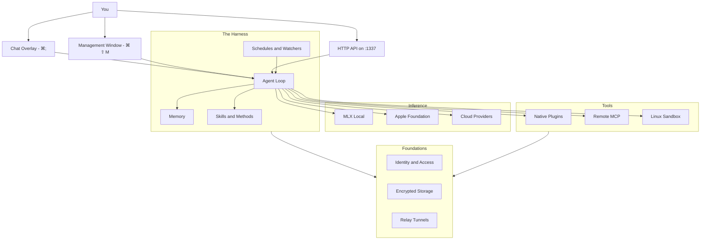

# Architecture

If you're building on top of Osaurus — writing plugins, scripts, or integrations — this page is the orientation. It maps the user-facing surfaces (chat overlay, Management window, HTTP API) to the components underneath, and points to the deeper pages for each layer.

## The harness

Osaurus presents three entry points:

- **The chat overlay** (`⌘;`) — the daily driver
- **The Management window** (`⌘ ⇧ M`) — settings, agents, models, plugins, tools, memory, themes, automation
- **The HTTP API** (on `:1337`) — OpenAI / Anthropic / Open Responses / Ollama / MCP

All three funnel into the same **agent loop**, which talks to your **memory**, **skills/methods**, and the **automation** surface (schedules, watchers). Inference goes out to local MLX, Apple Foundation, or any cloud provider you've connected. Tools span native plugins (v1–v6 ABI), remote MCP servers, and the Linux sandbox. Underneath everything: **identity** (signed requests, access keys), **local storage** (with opt-in SQLCipher encryption), and **relay** (public tunnels).

## How the pieces fit together

## Layers

| Layer | What it does | Reference |
|---|---|---|
| **Entry points** | Chat overlay (`⌘;`), Management window (`⌘ ⇧ M`), HTTP API on `:1337` | [Chat](/chat), [HTTP API](/api), [CLI](/cli) |
| **Harness** | Tasks, Memory, Skills/Methods, Schedules/Watchers — the continuity layer | [Tasks](/agent-loop), [Memory](/memory), [Skills](/skills), [Methods](/methods), [Schedules](/schedules), [Watchers](/watchers) |
| **Inference** | MLX local models, Apple Foundation Models, cloud providers — all behind the same picker | [Models](/models), [Apple Intelligence](/models/apple-intelligence), [Inference Runtime](/inference-runtime) |
| **Tools** | 20+ native plugins (Mail, Calendar, Browser, Git, …), remote MCP aggregation, the Linux Sandbox | [Tools & Plugins](/tools), [Plugin Authoring](/plugin-authoring), [Sandbox Internals](/sandbox), [Remote MCP Providers](/remote-mcp-providers) |
| **Foundations** | Identity (signed requests, `osk-v1` keys), local storage (opt-in SQLCipher), on-device Privacy Filter, Public Links (public tunnels) | [Identity Cryptography](/identity-internals), [Storage & Encryption](/storage), [Privacy Filter](/privacy-filter), [Public Links](/relay) |

## Entry points

### Chat overlay

A glass-style overlay summoned with `⌘;` from anywhere on macOS. Holds zero, one, or many chat windows. Each window has its own active agent, working folder / Sandbox state, model selection, and conversation history. Multi-window mode lets you run several agents side by side.

The overlay is also where voice input lives: the microphone in the input bar, plus VAD wake-word activation and global Transcription Mode.

### Management window

`⌘ ⇧ M`. Tabs for everything that isn't a single chat: Models, Providers, Agents, Plugins, Sandbox, Tools, Skills, Commands, Memory, Schedules, Watchers, Voice, Themes, Insights, Server, Permissions, Identity, Storage, Settings.

### HTTP API

A local server on port 1337 (configurable). Speaks OpenAI Chat Completions, Anthropic Messages, Open Responses, and Ollama Chat APIs side by side, plus MCP server endpoints (`/mcp/health`, `/mcp/tools`, `/mcp/call`) and Osaurus-specific routes (`/agents/{id}/run`, `/memory/ingest`, `/agents`, `/pair`).

## Harness

The harness is what makes Osaurus more than a thin SDK shim:

- **Agent Loop** — every chat is an agent loop. The model writes a markdown todo list, calls tools, iterates, and ends with a verified summary or pauses to ask one critical question.
- **Memory** — persistent on-device memory with three layers (identity, pinned facts, episodes) plus a transcript fallback. Distillation runs once per session, gated on a configured Core Model.
- **Skills & Methods** — reusable capabilities. [Skills](/skills) are markdown packages of expertise; [Methods](/methods) are scored YAML workflows the agent saved from past runs. Both are auto-selected via RAG preflight.
- **Schedules & Watchers** — automation. Schedules run on a clock; watchers react to file system changes via FSEvents.

Plugins, schedules, watchers, and the HTTP API all dispatch through the same agent loop — same engine, same loop tools, same intercepts. Sessions are tagged with their source (`chat` / `plugin` / `http` / `schedule` / `watcher`) so you can audit what spawned each conversation in the chat sidebar.

## Inference

Three local options and a cloud surface, all behind the same model picker:

- **MLX** — local transformer / SSM models, optimized for Apple Silicon via vmlx-swift-lm's `BatchEngine` (continuous batching, content-addressed prefix caching). [Inference Runtime →](/inference-runtime)
- **Apple Foundation Models** — Apple's on-device system model (`model: "foundation"`) on macOS 26+. Zero downloads, zero config.
- **Liquid Foundation Models** — non-transformer architecture optimized for edge.
- **Cloud providers** — OpenAI, Anthropic, Gemini, xAI, DeepSeek, MiniMax, Venice, AtlasCloud, Azure OpenAI, OpenRouter, Ollama, and more — plus the hosted **[Osaurus Router](/osaurus-router)**. API keys in macOS Keychain. [Remote Providers →](/remote-providers)

Memory and agent context persist across all of them — switching from local Gemma to Claude 4 doesn't lose what your agent has learned about you.

## Tools

An append-only host ABI for native plugins, **v1 through v6**:

- **v1** — tools only
- **v2** — full host API: HTTP routes, SQLite-backed config, web app serving, agent dispatch, inference, events
- **v3–v6** — streaming cancellation, agent-context introspection, structured logging, and a host-side string free path, each added without breaking older plugins

Plus **remote MCP providers** to aggregate tools from external MCP servers, and the **Linux Sandbox** (macOS 26+) for safe code execution. The sandbox itself accepts JSON-recipe plugins so users can extend an agent's capabilities without compiling anything.

Every tool — built-in, folder, sandbox, plugin, MCP-aggregated — returns the same canonical [Tool Contract](/tool-contract) envelope.

## Foundations

The trust layer underneath everything:

- **Identity** — secp256k1 master key in iCloud Keychain (biometric-gated), deterministic per-agent child keys, Apple App Attest device assertion, `osk-v1` access keys for external callers (scoped, expirable, revocable).
- **Storage** — SQLite across chat history, memory, methods, tool index, and plugin databases; FileVault covers at-rest protection by default, with opt-in SQLCipher whole-database encryption (key in macOS Keychain, device-bound). Large attachments spill to content-addressed blobs.
- **Public Links** — secure WebSocket tunnels through `agent.osaurus.ai` per agent. The agent's cryptographic address is the routing key. No port forwarding.

These are the boundaries. See [Security & Privacy](/security) for the user-facing summary, [Identity Cryptography](/identity-internals) and [Storage & Encryption](/storage) for the specs.

## Where to go next

Build a thing:

- [HTTP API](/api) — endpoint reference, streaming, function calling
- [SDK Examples](/sdk-examples) — Python, JavaScript, Anthropic SDK, Open Responses
- [CLI](/cli) — `osaurus serve / mcp / tools / run`
- [Tools & Plugins](/tools) → [Plugin Authoring](/plugin-authoring) → [Tool Contract](/tool-contract)
- [Sandbox Internals](/sandbox) — VM, vsock bridge, plugin recipes

Understand a piece:

- [Inference Runtime](/inference-runtime) — `BatchEngine`, KV cache, model leases
- [Identity Cryptography](/identity-internals) — full crypto spec
- [Storage & Encryption](/storage) — the plaintext default, opt-in SQLCipher, recovery
- [Developer Tools](/developer-tools) — Insights and Server Explorer in the Management window
- [Building from Source](/developer) — clone, build, test, contribute
