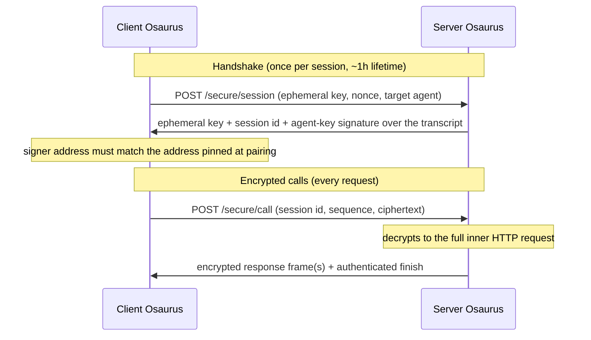

# Secure Channel

When two Osaurus agents talk to each other — across your home network or across the world through the [relay](/relay) — nobody in between can read, modify, replay, or truncate the conversation. Not your router, not the coffee-shop Wi-Fi, not even the relay infrastructure itself.

This is not "we use HTTPS." It's a dedicated cryptographic channel built on the same design patterns as TLS 1.3 and Signal, where the **only** parties holding the keys are the two agents at each end.

**There is nothing to configure.** Pairing two agents — over Bonjour on the LAN or via a relay invite — is all it takes. Sessions are established and refreshed transparently.

## Why it matters

Most connected-agent products route your prompts, responses, and credentials through infrastructure that can see everything. Even self-hosted setups using an ngrok-style tunnel hand the relay operator a TLS-terminating man-in-the-middle position by construction.

| | Typical cloud agents | Tunnel/relay setups | **Osaurus Secure Channel** |
|---|---|---|---|
| Who can read your prompts in transit | The provider | The relay operator | **Only the two agents** |
| Who can read your access credentials | The provider | The relay operator | **Only the two agents** |
| Past traffic safe if keys leak later | Usually not | Usually not | **Yes — forward secrecy** |
| Peer identity verified cryptographically | Account-based | Rarely | **Yes — pinned at pairing** |
| Replayed requests re-execute | Often | Often | **Never** |
| Silently truncated responses detected | No | No | **Yes** |
| Downgrade to plaintext possible | — | Often silently | **No — hard-refused** |

The relay becomes a **blind pipe**: it forwards ciphertext it cannot open.

## The guarantees

1. **End-to-end encrypted.** Every request and response — including streamed tokens — is sealed with ChaCha20-Poly1305 using keys that exist only on the two endpoints.
2. **Forward secrecy.** Session keys come from a fresh ephemeral X25519 exchange every session. Even if a device's long-term identity key is compromised later, recorded past traffic can never be decrypted.
3. **Mutual authentication.** The server signs the handshake with its secp256k1 agent key, and the client verifies it against the address pinned when you paired — an impostor or man-in-the-middle cannot complete a handshake. Your `osk-v1` access key travels *inside* the ciphertext, so after pairing, credentials never cross the network in plaintext again.
4. **Tamper, replay, and truncation proof.** A captured request can never re-execute. Response streams end with an authenticated finish frame, so a connection cut mid-stream is detected instead of silently passing as a complete answer.
5. **No downgrade, ever.** Remote plaintext requests to agent-execution routes are refused with `426 Upgrade Required`. There is no fallback mode an attacker can force. Local callers (CLI, App Intents, same-machine scripts) keep working unchanged.

## How it works

The channel is a SIGMA-style authenticated key exchange — the pattern underlying TLS 1.3 and the Noise framework — built from primitives Osaurus already trusts elsewhere: secp256k1 identity signatures, X25519, HKDF-SHA256, and ChaCha20-Poly1305.

Every encrypted call is a `POST /secure/call` whose ciphertext decrypts to the complete inner HTTP request — method, path, authorization, body. Server-side, the inner request flows through the existing auth gate, agent-scope check, and routing unchanged. Because the channel sits above HTTP, the relay carries opaque frames it cannot read.

### What it doesn't hide

Traffic timing and approximate sizes (true of any encrypted transport), and the routing metadata the relay needs (which tunnel a frame belongs to).

## Error reference

| Status | Code | Meaning | What to do |
|---|---|---|---|
| `426` | `secure_channel_required` | Plaintext request to a protected agent route from a remote caller | Upgrade Osaurus on the calling side |
| `401` | `secure_session_unknown` | Session expired or the server restarted | Re-handshake (automatic) |
| `409` | `secure_replay` | Sequence number already consumed | Never retry the same envelope |
| `400` | `secure_malformed` | Bad envelope | Fix the request |

## Compatibility

- **Osaurus ↔ Osaurus (current versions):** fully encrypted, automatic.
- **Osaurus ↔ older Osaurus:** older peers can't execute agents on upgraded peers until they upgrade — deliberately, so there's no downgrade path. A clear upgrade message appears on both sides.
- **Third-party OpenAI SDK clients:** unaffected. `/models` and metadata routes still accept plaintext; the requirement applies only to Osaurus peer agent-execution routes.
- **Local callers:** unaffected; loopback stays plaintext.

## How it fits the security stack

The Secure Channel composes with — it doesn't replace — the other layers:

- **Pairing** establishes *who* a peer is and pins the agent address the channel verifies on every handshake. See [Identity](/identity).
- **`osk-v1` access keys** still authenticate every call — now inside the ciphertext — with unchanged scoping and instant revocation.
- **Storage** protects data at rest; the Secure Channel protects it in motion between agents. See [Storage & Encryption](/storage).

---

**Related:**

- [Identity](/identity) — access keys and the chain of trust
- [Identity Cryptography](/identity-internals) — the key material behind the signatures
- [Public Links](/relay) — the relay the channel rides through
- [Security & Privacy](/security) — the overall trust story
