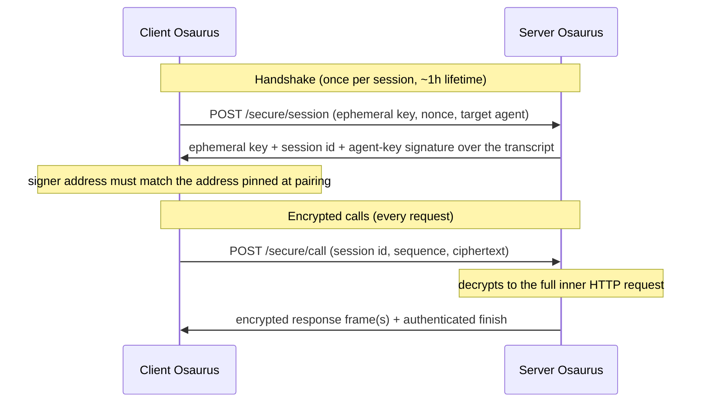

# Secure Channel

When your iPhone, a teammate, or another copy of Osaurus talks to an agent on your Mac, the conversation travels over the **Secure Channel**: a private, scrambled connection that only the two ends can read. Nobody in between can read it or change it. That includes your Wi-Fi, your internet provider, and even Osaurus's own [relay](/glossary#relay) servers.

**There's nothing to set up.** Osaurus uses the Secure Channel on its own whenever it's needed.

## When it's used

You don't turn the Secure Channel on. It just covers these connections:

- **Your iPhone.** Every message from the Osaurus iPhone app is scrambled on the phone and unscrambled only on your Mac. That's true at home and when you're away. See [Mobile](./mobile.md).
- **A teammate's Mac, or your other Mac.** When someone in a [workspace](/glossary#workspace) chats with one of your shared agents, or you use an agent on your other Mac, the conversation is protected the same way. See [Workspaces](/workspaces).
- **n8n workflows.** When an [n8n](/agent-channels#n8n) workflow talks to one of your agents from another machine, the Osaurus n8n add-on uses the Secure Channel too.

Apps on your own Mac, like the command line or Shortcuts, talk to Osaurus directly. Their messages never leave your computer, so they don't need it.

## What it protects

Think of it as a sealed envelope that only your Mac and the other device can open:

- **Nobody in between can read it.** Your messages, the agent's replies, and the [access key](/glossary#access-key) that proves who's asking all travel scrambled. The relay passes the envelope along but can't open it.
- **Old conversations stay safe.** Each session uses fresh, throwaway keys. Even if a device's keys were stolen later, someone who recorded earlier traffic still couldn't read it.
- **Impostors can't pretend to be your Mac.** When you pair a device, it remembers your agent's unique address. From then on, it checks that it's really talking to that agent before sending anything.
- **Messages can't be replayed or cut short.** Someone can't capture a request and send it again to run it twice. If a reply gets cut off partway, Osaurus notices instead of treating it as complete.
- **No way to switch it off from outside.** If another computer tries to run one of your agents without the Secure Channel, Osaurus refuses. An attacker can't trick it into an unprotected mode.

### What it doesn't hide

Like any encrypted connection, it can't hide *when* messages are sent or roughly how big they are. The relay also needs to know which Mac a message is for, so it can deliver it.

## How it compares

| | Typical cloud AI apps | Typical tunnel services | **Osaurus Secure Channel** |
|---|---|---|---|
| Who can read your messages on the way | The company running it | The tunnel operator | **Only the two ends** |
| Who can see your access key | The company running it | The tunnel operator | **Only the two ends** |
| Past messages safe if keys leak later | Usually not | Usually not | **Yes** |
| The other side's identity is checked | Through an account | Rarely | **Yes, from the moment you pair** |
| A captured request can be re-run | Often | Often | **Never** |
| A cut-off reply is noticed | No | No | **Yes** |
| Can be forced into unprotected mode | — | Often, silently | **No** |

## Compatibility

- **Current versions of Osaurus** use it automatically with each other.
- **The Osaurus iPhone app** always uses it to reach your Mac.
- **Older versions of Osaurus** can't run agents on an updated Mac until they update too. This is on purpose, so there's no weaker fallback. Both sides show a clear message asking you to update.
- **Other apps that use Osaurus like OpenAI's service** (through the [API](/glossary#api)) aren't affected. They can still list models and read basic information. The Secure Channel requirement only covers one Osaurus running another Osaurus's agents.
- **Apps on your own Mac** aren't affected.

## Troubleshooting

**"Upgrade Osaurus" message when reaching another Mac.** One side is running an older version. Update Osaurus on both Macs.

**A request failed after the Mac restarted.** The old session ended. Osaurus starts a new one on its own; just try again.

---

## Under the hood

The Secure Channel is a dedicated cryptographic channel, not just HTTPS. It follows the same design patterns as TLS 1.3 and Signal, and the only parties holding the keys are the two endpoints.

### The guarantees, technically

1. **End-to-end encrypted.** Every request and response, including streamed tokens, is sealed with ChaCha20-Poly1305 using keys that exist only on the two endpoints.
2. **Forward secrecy.** Session keys come from a fresh ephemeral X25519 exchange every session. Even if a device's long-term identity key is compromised later, recorded past traffic can't be decrypted.
3. **Mutual authentication.** The server signs the handshake with its secp256k1 agent key, and the client verifies it against the address pinned when you paired, so an impostor or man-in-the-middle can't complete a handshake. Your `osk-v1` access key travels *inside* the ciphertext, so after pairing, credentials never cross the network in plaintext again.
4. **Tamper, replay, and truncation proof.** Requests are sequence-numbered, so a captured request can never re-execute. Response streams end with an authenticated finish frame, so a connection cut mid-stream is detected.
5. **No downgrade.** Remote plaintext requests to agent-execution routes (`/agents/{id}/run`, `/agents/{id}/dispatch`) are refused with `426 Upgrade Required`. Relay traffic counts as remote even though it reaches the server over [loopback](/glossary#loopback). Local callers (CLI, App Intents, same-machine scripts) stay plaintext.

### Handshake and calls

The channel is a SIGMA-style authenticated key exchange (the pattern underlying TLS 1.3 and the Noise framework), built from primitives Osaurus already uses elsewhere: secp256k1 identity signatures, X25519, HKDF-SHA256, and ChaCha20-Poly1305.

```mermaid
sequenceDiagram
    participant C as Client Osaurus
    participant S as Server Osaurus
    Note over C,S: Handshake (once per session, ~1h lifetime)
    C->>S: POST /secure/session (ephemeral key, nonce, target agent)
    S->>C: ephemeral key + session id + agent-key signature over the transcript
    Note over C: signer address must match the address pinned at pairing
    Note over C,S: Encrypted calls (every request)
    C->>S: POST /secure/call (session id, sequence, ciphertext)
    Note over S: decrypts to the full inner HTTP request
    S->>C: encrypted response frame(s) + authenticated finish
```

Every encrypted call is a `POST /secure/call` whose ciphertext decrypts to the complete inner HTTP request: method, path, authorization, and body. On the server, the inner request goes through the normal auth gate, agent-scope check, and routing unchanged. Because the channel sits above HTTP, the relay carries opaque frames it can't read.

For n8n, when the [n8n channel](/agent-channels#n8n) is bound to a local agent, the Osaurus n8n community node pins that agent's address in the handshake and wraps every channel request in `/secure/call`. That lets a remote n8n work through the relay without enabling plaintext HTTP.

### Error reference

| Status | Code | Meaning | What to do |
|---|---|---|---|
| `426` | `secure_channel_required` | Plaintext request to a protected agent route from a remote caller | Upgrade Osaurus on the calling side |
| `401` | `secure_session_unknown` | Session expired or the server restarted | Re-handshake (automatic) |
| `409` | `secure_replay` | Sequence number already consumed | Never retry the same envelope |
| `400` | `secure_malformed` | Bad envelope | Fix the request |

### Compatibility details

- **Osaurus ↔ Osaurus (current versions):** fully encrypted, automatic.
- **Osaurus ↔ older Osaurus:** older peers can't execute agents on upgraded peers until they upgrade.
- **Third-party OpenAI SDK clients:** unaffected. `/models` and metadata routes still accept plaintext; the requirement applies only to Osaurus peer agent-execution routes.
- **Local callers:** unaffected; loopback stays plaintext.

### How it fits the security stack

The Secure Channel works alongside the other layers; it doesn't replace them:

- **Pairing** establishes *who* a peer is and pins the agent address the channel verifies on every handshake. See [Identity](/identity).
- **`osk-v1` access keys** still authenticate every call, now inside the ciphertext, with the same scoping and instant revocation.
- **Storage** protects data at rest; the Secure Channel protects it in motion between agents. See [Storage & Encryption](/storage).

---

**Related:**

- [Identity](/identity) — access keys and the chain of trust
- [Identity Cryptography](/identity-internals) — the key material behind the signatures
- [Public Links](/relay) — the relay the channel rides through
- [Security & Privacy](/security) — the overall trust story
